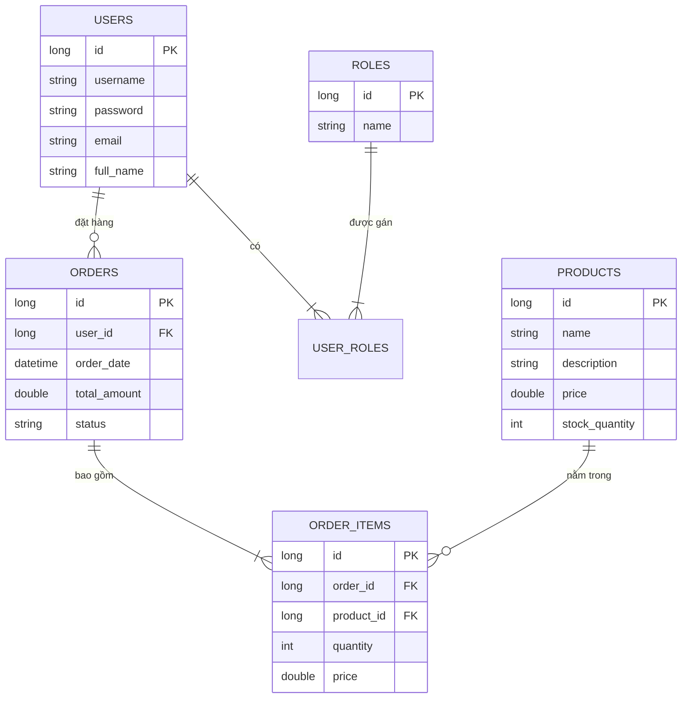

# Tài liệu Đặc tả Yêu cầu Phần mềm (SRS) - Hệ thống TechNova Smart E-Shop

## 1. Giới thiệu
### 1.1 Mục đích
Tài liệu này xác định các yêu cầu chi tiết cho hệ thống TechNova Smart E-Shop, một dự án chuyển đổi số nhằm thay thế việc quản lý bán hàng thủ công bằng dịch vụ web hiện đại.

### 1.2 Phạm vi
Hệ thống bao gồm cửa hàng trực tuyến cho khách hàng và trang quản trị cho nhân viên. Các chức năng chính bao gồm xem sản phẩm, giỏ hàng, quản lý đơn hàng, xác thực người dùng và phân quyền dựa trên vai trò (RBAC).

## 2. Mô tả tổng quan
### 2.1 Góc nhìn sản phẩm
Hệ thống Backend được xây dựng trên nền tảng Spring Boot, cung cấp các API RESTful cho giao diện web của khách hàng và cổng quản trị của nhân viên.

### 2.2 Các lớp người dùng và Đặc điểm
*   **Khách hàng (Customer)**: Xem sản phẩm, quản lý giỏ hàng và đặt hàng. Yêu cầu đăng ký/đăng nhập.
*   **Nhân viên kho (Staff)**: Quản lý danh mục sản phẩm (Thêm, Sửa, Xóa).
*   **Quản lý (Manager)**: Xem báo cáo doanh thu và quản lý quyền hạn của nhân viên.

## 3. Các yêu cầu cụ thể
### 3.1 Yêu cầu chức năng (Functional Requirements - FR)
*   **FR1: Xác thực người dùng**: Đăng ký, Đăng nhập, Đăng xuất sử dụng JWT.
*   **FR2: Quản lý sản phẩm (Công khai)**: Xem danh sách sản phẩm, xem chi tiết sản phẩm.
*   **FR3: Giỏ hàng**: Thêm/Xóa mặt hàng, cập nhật số lượng.
*   **FR4: Quản lý đơn hàng**: Quy trình thanh toán, xem lịch sử đơn hàng.
*   **FR5: Quản lý kho (Admin)**: Thêm, sửa, xóa sản phẩm (Chỉ dành cho Staff/Manager).
*   **FR6: Thống kê doanh thu**: Dashboard báo cáo bán hàng (Chỉ dành cho Manager).
*   **FR7: Quản lý người dùng**: Cấp quyền cho nhân viên (Chỉ dành cho Manager).

### 3.2 Yêu cầu phi chức năng (Non-functional Requirements - NFR)
*   **NFR1: Bảo mật**: Mã hóa dữ liệu, phân quyền dựa trên JWT, ngăn chặn truy cập trái phép.
*   **NFR2: Hiệu năng**: Thời gian phản hồi API < 500ms cho các yêu cầu thông thường.
*   **NFR3: Khả năng mở rộng**: Hỗ trợ lưu lượng truy cập đồng thời cao (tối ưu hóa truy vấn JPA).
*   **NFR4: Độ tin cậy**: Xử lý lỗi tập trung và trả về định dạng JSON chuẩn.

## 4. Thiết kế hệ thống (Mermaid)

### 4.1 Sơ đồ Use Case
```mermaid
usecaseDiagram
    actor "Khách hàng" as C
    actor "Nhân viên" as S
    actor "Quản lý" as M

    C --> (Xem sản phẩm)
    C --> (Quản lý giỏ hàng)
    C --> (Đặt hàng)
    C --> (Đăng nhập/Đăng ký)

    S --> (Quản lý kho sản phẩm)
    S --> (Đăng nhập)

    M --> (Quản lý kho sản phẩm)
    M --> (Xem thống kê doanh thu)
    M --> (Quản lý phân quyền)
    M --> (Đăng nhập)
```

### 4.2 Sơ đồ thực thể quan hệ (ERD)

